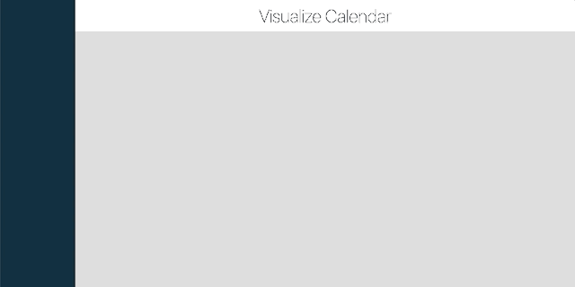

# simple svelte visualizer

This is a demonstration application that I have created to help me learn svelte by tackling a practical problem. 

The application can take a templated schedule (.csv) and create a visual display of the information to make it easier to undertsand specific metrics about each person in the schedule.

*Try it out by running the app and uploading the sample .csv file found in the ~/demo directory!*
<p align="center">
    
</p>

## Get started

Install the dependencies...

```bash
cd svelte-app
npm install
```

...then start [Rollup](https://rollupjs.org):

```bash
npm run dev
```

Navigate to [localhost:5000](http://localhost:5000). You should see your app running. Edit a component file in `src`, save it, and reload the page to see your changes.


## Deploying to the web

### With [now](https://zeit.co/now)

Install `now` if you haven't already:

```bash
npm install -g now
```

Then, from within your project folder:

```bash
now
```

As an alternative, use the [Now desktop client](https://zeit.co/download) and simply drag the unzipped project folder to the taskbar icon.

### With [surge](https://surge.sh/)

Install `surge` if you haven't already:

```bash
npm install -g surge
```

Then, from within your project folder:

```bash
npm run build
surge public
```
